#  The FCND C++ Project. Estimation.
Udacity Flying Car Nanodegree, Term 1 - Project 4 (Final).

This solution is based on the previous 3D control project. Control project extended by using different sensors (Gyro, Accelerometer, Magnetometer, GPS etc.) with solution how to deal with uncertainty of the measurements. It shows how different measurement units can be used together for calculating most probable drone state. The math that used in the project is explained in the [Estimation for Quadrotors](https://www.overleaf.com/read/vymfngphcccj#/54894644/) document.
- - -

## Overview ##

### Extended Kalman Filter (EKF). ###

The Kalman Filter and Extended Kalman Filter make the assumption that the distributions over belief state are Gaussian, represented as a mean and covariance matrix. The KF assumes that the transition and observation models are linear, and can be defined by a matrix. The EKF is the extension to the nonlinear
case, where we take use the Jacobian matrix of the transition and observation functions to compute a pointwise linear estimate, and then do the same updates as the Kalman Filter. We define the Extended Kalman Filter (EKF) algorithm as following:
<p align="center">
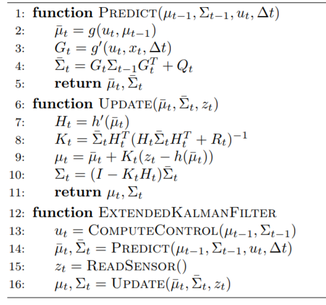
</p>

### Nonlinear Complementary Filter ###
For the nonlinear complementary filter, we use the state to define a quaternion, qt, for the euler angles for φ, θ and ψ. Then we can define dq to be the quaternion that consists of the measurement of the angular rates from the IMU in the body frame.  Using these two, we can define a predicted quaternion, qt bar as follows:

<p align="center">
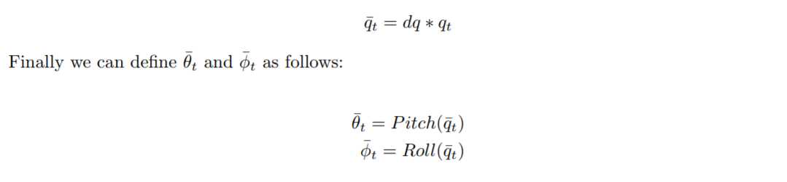
</p>


Using these predicated estimates, we can compute the non-linear complementary filter.

<p align="center">
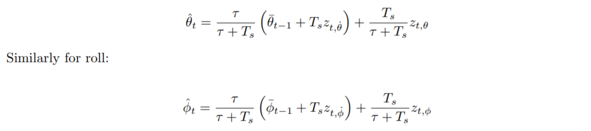
</p>

### Transition Model ###
Transition model is defined in terms of the rotation matrix Rbg which rotates from the body frame to the global frame.  Rotation order is following the convention from aerospace of using the 1, 2, 3 order for roll, pitch, and yaw.
This matrix is defined as follows:
<p align="center">
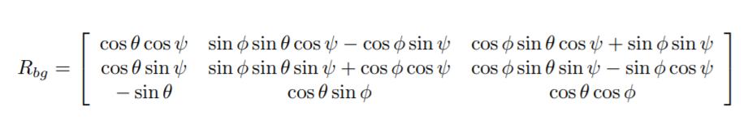
</p>

Then the transition function is:

<p align="center">
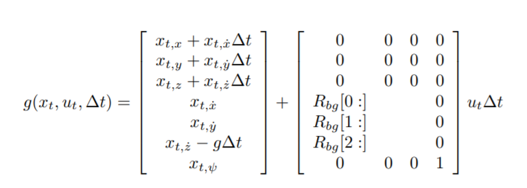
</p>

Then we take the Jacobian:

<p align="center">
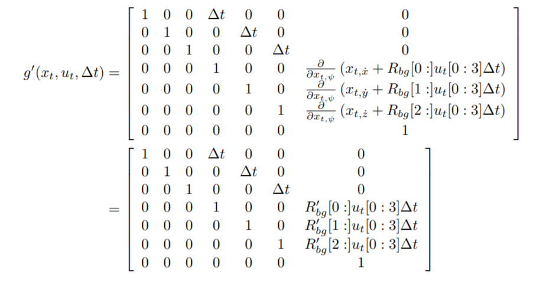
</p>
<p align="center">
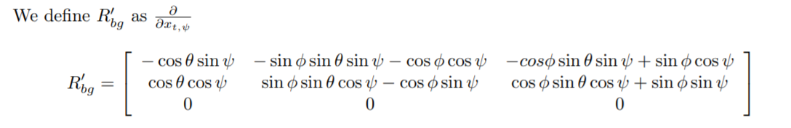
</p>

##Implementation ##

In the project repository structure [/src](./src) is the home folder for C++ code. Implemetation files are:

- [/src/QuadEstimatorEKF.cpp](./src/QuadEstimatorEKF.cpp) -  This is the file where I have implemented tasks.
- [/config/06_SensorNoise.txt](./config/06_SensorNoise.txt) - GPS and Accelerometer Standard deviation for Sensore Noise task.
- [/config/QuadEstimatorEKF.txt](./config/QuadEstimatorEKF.txt) - EKF parameters.

Control:
- [/src/QuadControl.cpp](./src/QuadControl.cpp) -  This file merged from the previous 3D Control Project.
- [/config/QuadControlParams.txt](./config/QuadControlParams.txt) - Drone parameters configuration file with tuned values.

### Tasks ###

#### Step 1: Sensor Noise ###

For this task I have completed followed steps:
1. I have run "Sensor Noise" scenario in the simulator for collecting sample data of the noisy sensors (GPS and Accelerometer).
2. Used Open Office Calc built-in STDEV function for calculating Standard Deviation on the output samples data (in CSV format) see: [/stdev_calc/Accel_Stdev_Calc.ods](./stdev_calc/Accel_Stdev_Calc.ods) and [/stdev_calc/GPS_Stdev_Calc.ods](./stdev_calc/GPS_Stdev_Calc.ods)
3. Updated values in the [/config/06_SensorNoise.txt](./config/06_SensorNoise.txt)
```MeasuredStdDev_GPSPosXY = 0.6653269777```
```MeasuredStdDev_AccelXY = 0.4830771657```
<p align="center">
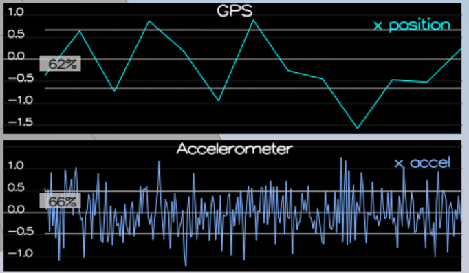
</p>

```
PASS: ABS(Quad.GPS.X-Quad.Pos.X) was less than MeasuredStdDev_GPSPosXY for 68% of the time
PASS: ABS(Quad.IMU.AX-0.000000) was less than MeasuredStdDev_AccelXY for 67% of the time
```

#### Step 2: Attitude Estimation ####
Class member function :```void QuadEstimatorEKF::UpdateFromIMU(V3F accel, V3F gyro)```
Changed provided Linear Complimentary Filter code to Nonlinear by using complimentary ```Quaternion<float>``` class methods.

<p align="center">

</p>

#### Step 3: Prediction Step ####
Class member functions :
```MatrixXf QuadEstimatorEKF::GetRbgPrime(float roll, float pitch, float yaw)```
Implemented R prime matrix calculation
```void QuadEstimatorEKF::Predict(float dt, V3F accel, V3F gyro)```
Implemented predict step of the EKF by calculating Jacobian.

<p align="center">
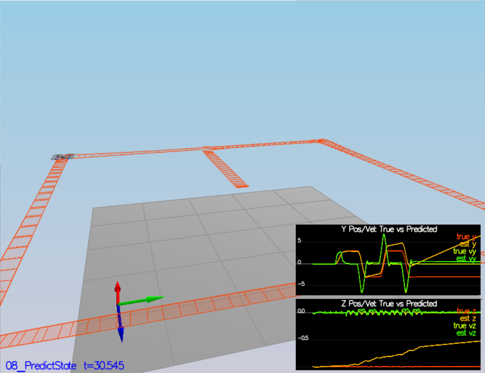
</p>

<p align="center">
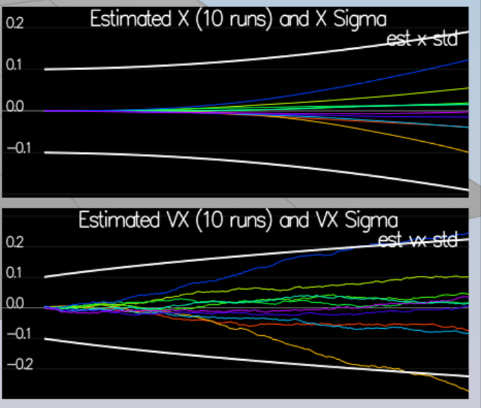
</p>

#### Step 4: Magnetometer Update ####
Class member functions :
```void QuadEstimatorEKF::UpdateFromMag(float magYaw)```
Implemented state update with Magnetometer measurement.

```
PASS: ABS(Quad.Est.E.Yaw) was less than 0.120000 for at least 10.000000 seconds
PASS: ABS(Quad.Est.E.Yaw-0.000000) was less than Quad.Est.S.Yaw for 61% of the time
```

<p align="center">
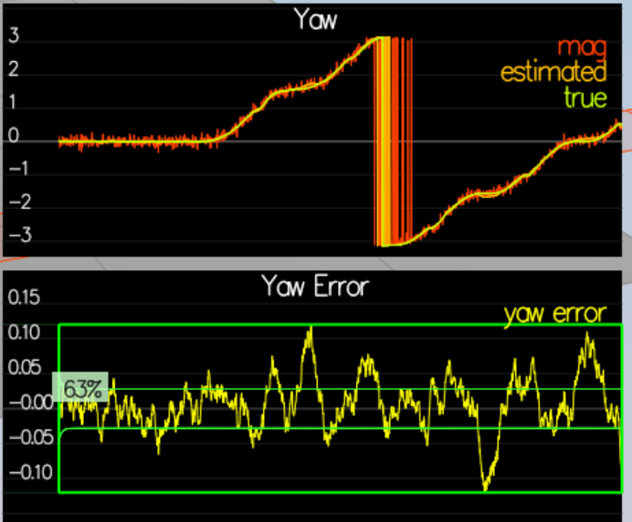
</p>

#### Step 5: Closed Loop + GPS Update ####
Class member functions :
```void QuadEstimatorEKF::UpdateFromGPS(V3F pos, V3F vel)```
Implemented simple state update from GPS.

```
Simulation #157 (../config/11_GPSUpdate.txt)
PASS: ABS(Quad.Est.E.Pos) was less than 1.000000 for at least 20.000000 seconds
```

<p align="center">
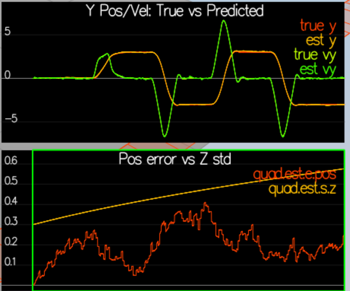
</p>


#### Step 6: Adding Your Controller ####
Just merged code from my previous [3D Control](https://github.com/artak-petrosyan/FCND-Controls-CPP) project code.
